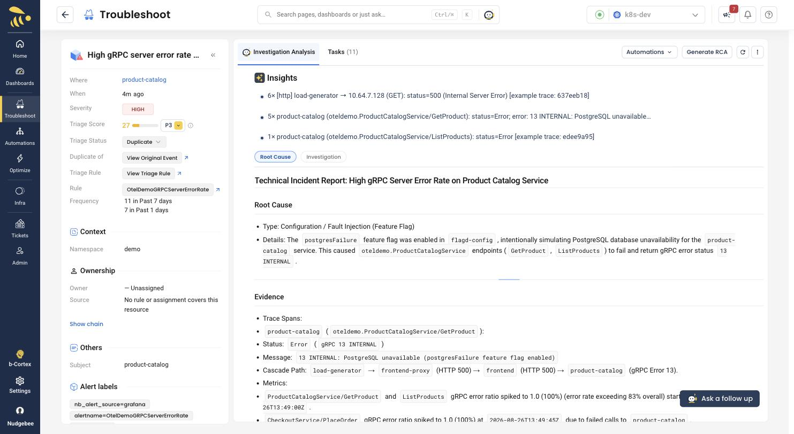
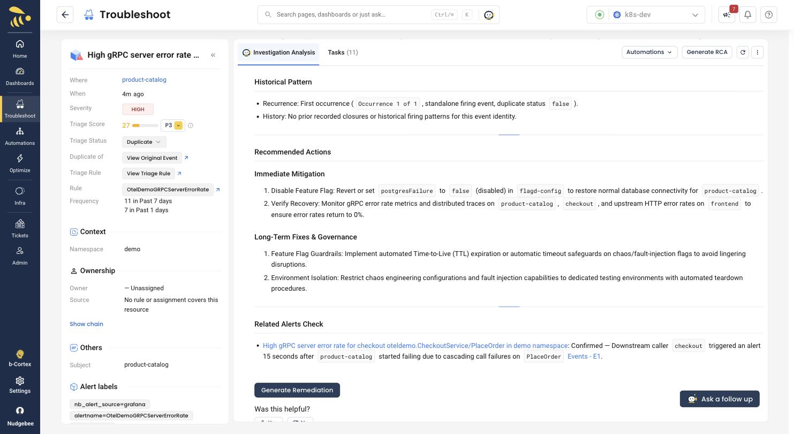

# Scenario A: Database outage

**Flag:** `postgresFailure=on` | **Service:** `product-catalog` |
**Detection:** ~2.5 min | **Status:** verified

The best all-round scenario. One flag produces a total catalog outage, a
measurable cascade into a second service, and an RCA that names the cause
rather than describing the symptom.

## What it does

`product-catalog` fails every PostgreSQL query with
`13 INTERNAL: PostgreSQL unavailable`. The storefront returns HTTP 500.
`checkout` calls `product-catalog` during `PlaceOrder`, so it starts failing
too, a few seconds behind.

## Run it

```bash
S=./deploy/kubernetes/sample-app/scenario.sh

$S postgresFailure on
$S --check postgresFailure       # confirm flagd is really serving it
```

Objective check -- this must return 500, and 200 when the flag is off:

```bash
kubectl -n demo port-forward deploy/frontend-proxy 8080:8080 &
curl -s -o /dev/null -w '%{http_code}\n' \
  'http://localhost:8080/api/products?currencyCode=USD'
```

Leave the fault running until the investigation and any follow-up questions
have finished. NudgeBee inspects live state -- reset too early and it will
correctly report that nothing is wrong *now*, having missed what happened.

## What you should see

Two alerts fire on `OtelDemoGRPCServerErrorRate`: one on `product-catalog`
(the cause) and one on `checkout` (a caller).

In **Troubleshoot -> All Events -> Triage Inbox**, filter **Event Type** to the
`OtelDemo*` rules. Those rules only exist for this demo, so this is the
quickest way to a demo-only view -- the filter is stored in the URL, so you
can bookmark it.


Click **Investigate** on the `product-catalog` row.

## The RCA



Unedited, from the run that produced the screenshot above:

> **Root Cause**
>
> Type: Configuration / Fault Injection (Feature Flag)
>
> Details: The `postgresFailure` feature flag was enabled in `flagd-config`,
> intentionally simulating PostgreSQL database unavailability for the
> `product-catalog` service. This caused `oteldemo.ProductCatalogService`
> endpoints (`GetProduct`, `ListProducts`) to fail and return gRPC error
> status `13 INTERNAL`.
>
> **Evidence**
>
> Cascade Path: `load-generator` -> `frontend-proxy` (HTTP 500) ->
> `frontend` (HTTP 500) -> `product-catalog` (gRPC Error 13).

Note what that is doing: naming the trigger, quoting the exact error string,
and reconstructing the full request path from trace data.

## The blast radius

Scroll to **Related Alerts Check**. This is the part worth pausing on in a
demo -- it ties the second alert to the first with a measured offset:



> High gRPC server error rate for checkout `oteldemo.CheckoutService/PlaceOrder`
> in demo namespace: **Confirmed** -- Downstream caller `checkout` triggered an
> alert 15 seconds after `product-catalog` started failing due to cascading call
> failures on `PlaceOrder`.

Two alerts, one incident. On an earlier run the same correlation was measured
at 29 seconds; the exact offset varies with scrape timing.

## Go further

**Ask a follow up** is where code analysis happens -- it is *not* automatic.
The investigation runs about ten tasks (timeline, labels, dependencies,
metrics, traces, threshold tuning, resource check) and none of them reads
source. You have to ask:

> Using the annotated source repository for this workload, show me the exact
> file and lines that cause this.

This works because [`annotate-workloads.sh`](../annotate-workloads.sh) put
`workloads.nudgebee.com/git.repo` and `git.hash` on the deployment. Nubi reads
the annotations, clones the repo at that commit, and greps it.

## Known rough edges

- **Triage scores it 27 / P3** despite being a total catalog outage. Worth
  knowing before you present it. The score is damped by `environment=non_prod`.
- The **Historical Pattern** section may report `First occurrence` and
  `duplicate status false` while the sidebar simultaneously shows **Duplicate**
  and a 7-day frequency count. The sidebar is right.
- Repeat runs of this scenario **deduplicate into the existing chain** rather
  than creating a fresh event. For a clean first-run view, use a scenario you
  have not run recently.

## Clean up

```bash
$S postgresFailure off
```
