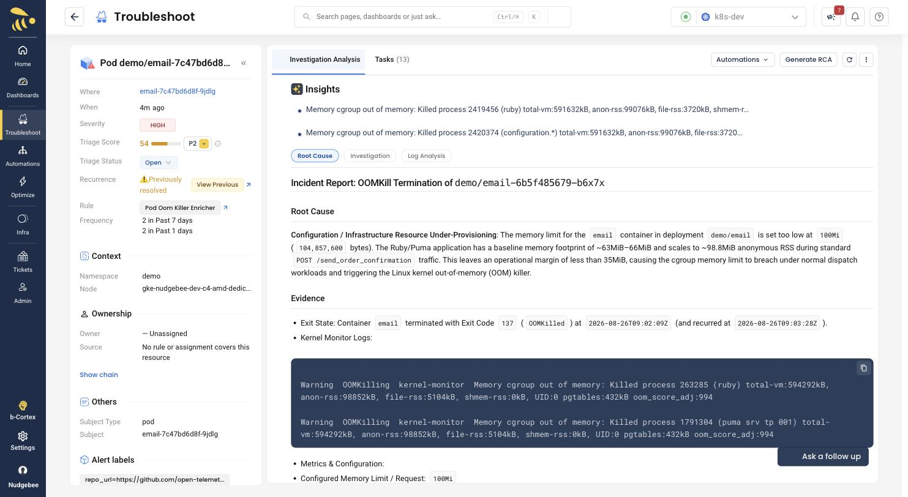

# Scenario B: Memory leak

**Flag:** `emailMemoryLeak=10000x` | **Service:** `email` |
**Detection:** under 30s at VUs=50 | **Status:** verified

The most deterministic scenario in the set. No alert rules, no thresholds, no
metric-coverage caveats -- the kernel OOM killer is the signal. If you only
have time to demo one thing and want it to work every time, use this.

## What it does

The Ruby/Puma heap grows with every order confirmation until the container
hits its 100Mi limit and is OOMKilled. About 75 seconds later the pod enters
`CrashLoopBackOff` (measured: OOM at 17:13:02, CrashLoopBackOff at 17:14:17).

## Expect the RCA to blame the memory limit

This is the caveat to get ahead of, because the report says something quite
different from what you just did:

> Configuration / Infrastructure Resource Under-Provisioning: The memory limit
> for the `email` container [...] is set too low at `100Mi`
>
> [...] no in-code memory leak when the `emailMemoryLeak` flag is off. The
> issue is an infrastructure/deployment resource allocation constraint.



Its supporting number is `anon-rss: 98852kB` from the kernel OOM log,
presented as evidence that normal traffic nearly fills a 100Mi limit. That
reasoning is circular -- a container is always near its limit at the instant
the OOM killer fires, whatever the limit happens to be.

We measured the actual baseline. With the leak **off** at
`loadGeneratorVUs=50`, `email` is flat at **~55Mi across a 9 minute soak with
zero restarts** -- roughly 45Mi of headroom, not 2MiB. The limit is fine; the
leak is what kills it.

**So do not "fix" this by raising the limit.** We tried 192Mi. The leak simply
grows to fill that instead and the next report quotes a bigger number for the
same reason. Nothing is gained.

What this is actually good for: it is a clean, reproducible example of an RCA
reaching a confident wrong conclusion from real evidence. If you are talking
to an SRE audience that cares about trusting AI analysis, that is a more
interesting conversation than another success story -- and
[Scenario A](./01-database-outage.md) is right there when you want the
success story.

## Run it

```bash
S=./deploy/kubernetes/sample-app/scenario.sh

$S emailMemoryLeak 10000x
$S loadGeneratorVUs 50           # more orders = faster leak
$S --check emailMemoryLeak
```

`loadGeneratorVUs 50` is what makes this fast -- the leak is driven
per-request, so it needs order volume. **Put it back to 5 afterwards**; it is
usually a shared cluster.

Objective check -- this must print `OOMKilled`:

```bash
kubectl -n demo get pod -l app.kubernetes.io/name=email \
  -o jsonpath="{.items[0].status.containerStatuses[0].lastState.terminated.reason}"
```

## Do not run this with paymentFailure

`checkout` calls `chargeCard` **before** `sendOrderConfirmation`. Any payment
failure aborts the order before `email` is invoked, so the leak gets no
traffic and this scenario silently never fires. See
[Scenario D](./04-payment-failure.md).

## What you should see

Two Kubernetes events from `kubernetes_api_server`, not from any alert rule:

1. `OOMKilled` on `email`
2. `CrashLoopBackOff` on `email`, about 75 seconds later

Because these come from the Kubernetes API rather than Prometheus, this
scenario works even if your alert rules are not installed -- useful for
proving the agent is wired up before you invest in rule setup.

## Why this one scores highest

Scored **69 / P1**, far above the error-rate scenarios, and the report shows
its own arithmetic:

> Intrinsic Base 62 | Environment `non_prod` -8 |
> Blast Radius `single_workload` 0 |
> Correlation `likely_root_cause` +15 | Confidence 0.9

That breakdown is worth showing to anyone who asks "where does the priority
number come from" -- it is not a black box, and the `non_prod` penalty is why
the other scenarios land at P3.

It also assembles the incident rather than reporting two separate problems,
correlating the `CrashLoopBackOff` as:

> a direct downstream failure caused by container restart loops following the
> OOM kill

## Go further

This scenario has the best payoff for **Ask a follow up**, because the leak is
a specific piece of code:

> Using the annotated source repository for this workload, show me the exact
> file and lines that cause this.

On our run it returned `main.go:208`, `main.go:215` and `main.go:221` -- all
three verified correct against the real source at that commit. This works
because [`annotate-workloads.sh`](../annotate-workloads.sh) recorded the repo
and commit on the deployment.

Then **Generate Remediation -> Fix it** turns the analysis into a proposed
action, such as raising the memory limit, with approval required before
anything is applied.

## Clean up

```bash
$S emailMemoryLeak off
$S loadGeneratorVUs 5            # do not leave this at 50
```
