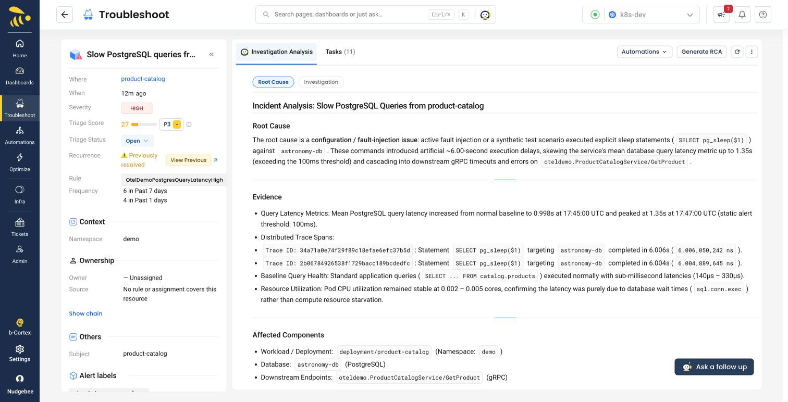

# Scenario C: Slow dependency

**Flag:** `postgresSlow=6sec` | **Service:** `product-catalog` |
**Detection:** ~2m30s | **Status:** verified

The correlation story. Nothing is failing -- every request still returns
HTTP 200 -- but a shared dependency has become slow, and the naive monitoring
answer points at the wrong services.

## What it does

Every product-catalog PostgreSQL query sleeps for 6 seconds of **real
database time** (via `pg_sleep`, so it shows up as genuine DB span duration,
not a fake delay). Product queries go from ~0.8s to ~6.8s.

## Run it

```bash
S=./deploy/kubernetes/sample-app/scenario.sh

$S postgresSlow 6sec
$S --check postgresSlow
```

**Which variant to use.** The two rules involved have very different
thresholds, so this is not a single answer:

| Rule | Threshold | Fires on |
| --- | --- | --- |
| `OtelDemoPostgresQueryLatencyHigh` | mean DB latency > **100ms** for 1m | `1sec`, `3sec` or `6sec` |
| `OtelDemoHighLatency` | HTTP p95 > **5s** for 1m | `6sec` only |

`6sec` is the default recommendation because it fires **both**, giving you the
dependency alert and the caller-side symptom alerts to contrast. If you want a
subtler demo -- the database rule catching something the symptom rules miss
entirely -- `1sec` is the better choice and still crosses the 100ms threshold
comfortably.

Objective check -- `time_total` must exceed 6s while the status stays 200:

```bash
kubectl -n demo port-forward deploy/frontend-proxy 8080:8080 &
curl -s -o /dev/null -w '%{http_code} in %{time_total}s\n' \
  'http://localhost:8080/api/products?currencyCode=USD'
```

Measured on our run: `200 in 6.81s`, against a `200 in 0.8s` baseline.

## Wait for the investigation to finish before judging it

**Give it about 10 minutes from the alert.** This matters more here than
anywhere else in the set, and it caught us twice.

The investigation runs a fast first pass and then a deeper one that
**overwrites the first in place**. Read it early and you get:

> **Root Cause:** Undetermined -- insufficient evidence.

Read the same event once the deep pass lands and you get the report below.
Measured on our run: alert at 17:45:34, final investigation written at
17:54:38 -- just over 9 minutes. Nothing in the UI tells you which pass you
are looking at, so if the root cause says `Undetermined`, wait and reload
before concluding anything.

## The RCA



Unedited:

> The root cause is a **configuration / fault-injection issue**: active fault
> injection or a synthetic test scenario executed explicit sleep statements
> (`SELECT pg_sleep($1)`) against `astronomy-db`. These commands introduced
> artificial ~6.00-second execution delays [...]
>
> **Evidence**
>
> Trace ID `34a71a0e74f29f89c18efae6efc37b5d`: Statement `SELECT pg_sleep($1)`
> targeting `astronomy-db` completed in 6.006s.
>
> Baseline Query Health: Standard application queries
> (`SELECT ... FROM catalog.products`) executed normally with sub-millisecond
> latencies (140us - 330us).
>
> Resource Utilization: Pod CPU utilization remained stable at 0.002 - 0.005
> cores, confirming the latency was purely due to database wait times
> (`sql.conn.exec`) rather than compute resource starvation.

This is the strongest evidence section of any scenario here. It names the
exact SQL, cites two trace IDs with nanosecond durations, contrasts them
against healthy queries in the same database to show the problem is not the
schema, and rules out CPU starvation with numbers. It also correlates the
downstream gRPC error alert as caused by the blocked database operations.

Triage scores it **27 / P3**.

## Drain between scenarios

Required here -- on a contaminated run the evidence panel filled with
`13 INTERNAL: PostgreSQL unavailable` errors from the *previous* scenario,
which is actively misleading:

```bash
$S --drain http://localhost:9090     # or set PROM_URL
$S postgresSlow 6sec
```

`--drain` resets every fault flag, polls until no `OtelDemo*` alert is
firing, then settles (`DRAIN_SETTLE`, default 300s). Without a Prometheus URL
it still resets and settles, and prints the query to check by hand.

## What you should see

`OtelDemoPostgresQueryLatencyHigh` on **product-catalog**, carrying the
`db_system_name=postgresql` label. Measured at **2m32s** from trigger to
firing on our run.

`OtelDemoHighLatency` may also fire on the callers as p95 crosses 5s.

## Why this scenario exists

This is the point worth making to an SRE audience.

Symptom-based latency rules only ever alert on a slow dependency's
**callers**. So a slow database presents as several unrelated services all
going slow at once, with nothing in any alert naming the database. Everyone
has had that page.

`OtelDemoPostgresQueryLatencyHigh` closes that gap by alerting on database
time itself and carrying `db_system_name`, so the alert names the cause
rather than the symptom.

A note for anyone adapting the rule: do not rewrite it as a quantile rule.
The histogram bucket boundaries in this demo make `histogram_quantile`
meaningless here -- [`alerts/README.md`](../alerts/README.md) explains why.

## Clean up

```bash
$S postgresSlow off
```
