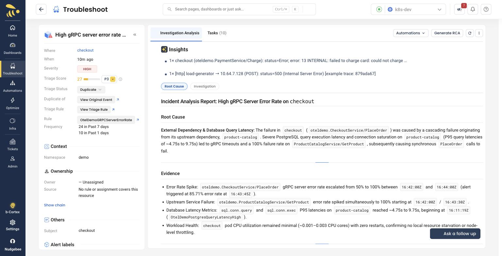

# Scenario E: Payment unreachable

**Flag:** `paymentUnreachable=on` | **Service:** `payment` |
**Detected on:** `checkout` | **Detection:** ~2m40s | **Status:** verified

A network-level variant of [Scenario D](./04-payment-failure.md): instead of
the charge being declined, `payment` cannot be reached at all.

## Read this first

Everything in [Scenario D's caveat](./04-payment-failure.md#read-this-first)
applies unchanged. **The alert fires on `checkout`, never on `payment`**,
because `payment` emits no gRPC server metrics.

These two scenarios produce the **same alert on the same service against the
same RPC**. That matters for how you run them -- see below.

It has a second consequence worth knowing before you plan a session: the same
alert means the same dedup fingerprint, so **whichever of D and E you run
second will reuse the first one's RCA** rather than generating its own. The
report you are reading may describe the other scenario. Demo one of the two,
or leave a day between them -- analyses are pinned for 24h, and the
`Generate RCA` button does not override that.

## What it does

`checkout` cannot reach `payment` during `PlaceOrder`. The call fails at the
transport layer rather than returning a business-level decline, so the error
surfaces as a connection failure rather than a rejected charge.

## Run it in isolation

This is the one scenario in the set where isolation is a correctness
requirement, not tidiness. Because it fires the same alert as
`paymentFailure`, a still-firing run of that flag would keep the `checkout`
alert continuously active and the result would be credited to this flag
without it having done anything.

That is exactly how this scenario was verified:

```bash
S=./deploy/kubernetes/sample-app/scenario.sh

$S --drain http://localhost:9090   # reset, wait for alerts to resolve, settle
$S paymentUnreachable on
$S --check paymentUnreachable
```

`--drain` is doing the important part: confirming every `OtelDemo*` alert has
actually **resolved**, not merely that you turned the flags off. Skipping it
here does not just degrade the evidence -- it invalidates the result.

Expect the alert in about **2m40s**.

## What you should see

`OtelDemoGRPCServerErrorRate` on **checkout**, against
`oteldemo.CheckoutService/PlaceOrder` -- identical in shape to Scenario D.

## The dedup chain will hijack the RCA

This is the one you have to plan around, and it is the reason to run this
scenario **on a checkout chain that has not already fired today**.

Our verified run: `paymentUnreachable` on at 17:55:26, alert at 17:58:01.
The **Insights** panel was correct --

> 1x checkout (`oteldemo.PaymentService/Charge`): status=Error; error:
> `13 INTERNAL: failed to charge card: could not charge...`

-- but the RCA narrative directly above it described a completely different
incident:

> **External Dependency & Database Query Latency:** The failure in `checkout`
> was caused by a cascading failure originating from its upstream dependency,
> `product-catalog`. Severe PostgreSQL query execution latency [...]



Its Evidence cited `16:42:00Z`-`16:44:00Z` and its Historical Pattern listed
five occurrences ending at `16:43:45Z` as "Firing -- Current". All of that
belongs to the earlier `postgresFailure` / `postgresSlow` runs, not to
payment. The event was `nb_status=DUPLICATE` in a checkout chain that started
at 16:43, and the investigation reasoned about the **chain leader's** incident.
It also completed in 11 seconds, which is a decent tell that it did not
re-derive anything.

Practical consequences:

- **Check the sidebar for `Duplicate of` before you present.** If it is there,
  the RCA may be describing an older incident. The Insights panel is the
  honest signal.
- Run this scenario when `checkout` has been quiet, or after clearing prior
  analyses -- `Generate RCA` will not rescue it.
- Same reasoning applies to any repeated scenario, but it bites hardest here
  because `checkout` is the shared blast-radius target for D, E **and** both
  postgres scenarios.

## What distinguishes it from Scenario D

The alert is the same; the *evidence* is not. In the RCA's **Evidence** and
trace spans, look for a connection-level failure reaching `payment` rather
than a charge that was processed and declined.

This is a good pairing to demo back-to-back precisely because the alert cannot
tell the two apart. The alert says "checkout is erroring on PlaceOrder" in both
cases. Only the underlying trace and log evidence separates "the dependency
said no" from "the dependency was not there".

Worth asking under **Ask a follow up**:

> Is checkout failing because payment rejected the request, or because it
> could not reach payment at all? Cite the span evidence.

## Clean up

```bash
$S paymentUnreachable off
```

Again, confirm the `checkout` alert resolves before running Scenario D, or the
next run inherits this one's firing alert.
