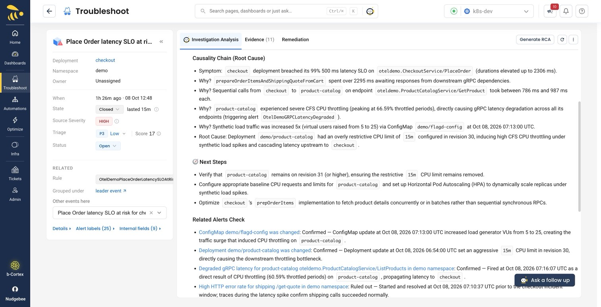

# Scenario F: Undersized service under growing traffic

**Change:** CPU limit on `product-catalog` | **Detected on:** `checkout`
(Place Order SLO) | **Detection:** ~5 min after traffic rises |
**Status:** verified

The capacity story, and the only walkthrough here with no fault flag. A
deploy gives a service less CPU than it is going to need. Nothing breaks.
Then traffic grows, orders slow down step by step, and the alert that fires
is about the customer's order, not about the service that was changed.

Use it when the audience has seen enough injected failures. Nothing in any
log says what is wrong, so the cause has to be worked out from evidence.

## What it does

`product-catalog` is redeployed with a `15m` CPU limit. Measured without the
limit, it uses about 5-7m at the demo's default load and about 16m at 25
virtual users. So the limit covers the average at the default load, though
bursts are already throttled, and it is well short of what 25 users need.

Placing an order calls `product-catalog` once per cart item, one after the
other. When those calls slow down, `checkout`'s `PlaceOrder` slows down by
the sum of them.

| Stage | CPU throttled | `product-catalog` p95 | `PlaceOrder` p95 | Orders over 500 ms |
| --- | --- | --- | --- | --- |
| Before | none | 19 ms | 65 ms | 0% |
| Limit applied, 5 users | 30-42% | up to 480 ms | up to 390 ms | 0% |
| 10 users | 33-44% | 425-700 ms | 215-425 ms, one burst over 6 s | 0%, up to 14% in the burst |
| 25 users | 54-70% | 0.6-1.7 s | 0.7-2.4 s | 15-24% |
| Rolled back, still 25 users | none | 20-21 ms | 49-63 ms | 0% |

Each range leaves out the first minute or two after a step, while the
readings were still catching up. "Before" is a single reading.

The second row is the point of the scenario: orders are several times
slower than before and still inside a 500 ms objective. A threshold on the
order itself sees nothing yet.

The burst in the third row lasted about two minutes. Orders took over six
seconds, about one in ten failed, and it set off alerts of its own -- see
below.

## Before you start

**Apply the alert rules.** The alert this scenario is built around lives in
[`alerts/otel-demo-slo-alerts.yaml`](../alerts/otel-demo-slo-alerts.yaml)
and is installed by `apply-alerts.sh` with the rest.

**Start from a quiet demo.** Drain first, as for every scenario:

```bash
S=./deploy/kubernetes/sample-app/scenario.sh

$S --drain http://localhost:9090     # or set PROM_URL
```

**This one does not expire by itself.** Every `fault.sh` scenario reverts
when its deadline passes. This is a change to a Deployment, and it stays
until someone rolls it back. That rollback is the fix the scenario is about,
so do not leave before you have done it.

## Run it

Deploy the change:

```bash
kubectl -n demo set resources deploy/product-catalog \
  -c product-catalog --limits=cpu=15m
kubectl -n demo rollout status deploy/product-catalog
```

Leave it for a few minutes at the default load, so the deploy and the
traffic rise are clearly two separate moments. Then raise the traffic:

```bash
$S loadGeneratorVUs 25
```

On our run we went through 10 users for twelve minutes on the way, which is
where the 10-user row above comes from. The alert is driven by the 25-user
step, so the middle step is optional; going straight from 5 to 25 is not
something we have timed.

Objective check -- the share of CPU periods in which `product-catalog` was
throttled. About 0.3-0.4 at the default load and 0.55-0.7 at 25 users:

```promql
sum(rate(container_cpu_cfs_throttled_periods_total{namespace="demo", container="product-catalog"}[2m]))
/
sum(rate(container_cpu_cfs_periods_total{namespace="demo", container="product-catalog"}[2m]))
```

The metric only exists once a CPU limit is set, so an empty result before
the deploy is correct.

## What you should see

A change event for the `product-catalog` Deployment at the moment of the
deploy, then these alerts, in the order they fired on our run:

| When | Alert | On | Severity |
| --- | --- | --- | --- |
| ~4 min after the deploy | `OtelDemoGRPCLatencyDegraded` | product-catalog | warning |
| ~4 min after the deploy | `OtelDemoLatencyDegradedLegacy` | frontend | warning |
| 13 min after the deploy, at 10 users | `OtelDemoGRPCLatencyDegraded` | checkout | warning |
| 16 min after the deploy, in the burst | `OtelDemoHTTPErrorRate`, `OtelDemoHighLatency` | shipping | critical, warning |
| 16 min after the deploy, in the burst | `OtelDemoGRPCServerErrorRate` | checkout | critical |
| ~5 min after the step to 25 users | `OtelDemoPlaceOrderLatencySLOAtRisk` | **checkout** | critical |

The first three are the early warning: services are slow and the customer
has not noticed. They are `severity: warning`, so they are raised but not
investigated automatically.

The burst alerts are critical, short-lived, and a distraction: the SLO
alert is not the first critical alert you will see if you pass through 10
users. The finished investigation checks them and rules
the `shipping` ones out as unrelated.

## Wait for the investigation to finish before judging it

It took **just under 24 minutes** from the alert on our run, against the
roughly 10 minutes the flag scenarios take. Leave the limit in place until
it is done. We rolled back under twelve minutes in, and the finished
report shows it: its first next step is to check that the limit stays
removed.

## The investigation



Unedited, evidence links removed:

> **Symptom:** `checkout` deployment breached its 99% 500 ms latency SLO on
> `oteldemo.CheckoutService/PlaceOrder` (durations elevated up to 2306 ms).
>
> **Why?** `prepareOrderItemsAndShippingQuoteFromCart` spent over 2295 ms
> awaiting responses from downstream gRPC dependencies.
>
> **Why?** Sequential calls from `checkout` to `product-catalog` on endpoint
> `oteldemo.ProductCatalogService/GetProduct` took between 786 ms and 987 ms
> each.
>
> **Why?** `product-catalog` experienced severe CFS CPU throttling (peaking
> at 66.59% throttled periods), directly causing gRPC latency degradation
> across all its endpoints (triggering alert `OtelDemoGRPCLatencyDegraded`).
>
> **Why?** Synthetic load traffic was increased 5x (virtual users raised
> from 5 to 25) via ConfigMap `demo/flagd-config` [...]
>
> **Root Cause:** Deployment `demo/product-catalog` had an overly
> restrictive CPU limit of `15m` configured in revision 30, inducing high
> CFS CPU throttling under synthetic load spikes and cascading latency
> upstream to `checkout`.

What is worth pointing at:

- The alert was on `checkout`. The answer is a setting on a different
  service, found by following the order's own trace into
  `product-catalog`.
- It used two changes and kept them apart: the deploy that set the limit,
  and the traffic rise that exposed it nineteen minutes later. It names the
  Deployment revision.
- In the paragraph above the chain it gives the throttling it measured,
  38.89% rising to 66.59%, and says what that rules out: a deadlock in the
  application, or overhead from the telemetry exporter.
- Under "Related Alerts Check" it goes through the other alerts around the
  incident one by one, confirms the two changes and the `product-catalog`
  latency alert, and rules out the `shipping` alerts from the burst.

Its next steps were to keep the limit removed, to give `product-catalog`
proper CPU requests and limits with autoscaling, and to make `checkout`
fetch products concurrently instead of one at a time.

Triage scores the SLO event **17 / P3**.

## Fix it

Roll the Deployment back while the traffic is still high. That way the
recovery is plainly the fix, and not the load dropping:

```bash
kubectl -n demo rollout undo deploy/product-catalog
kubectl -n demo rollout status deploy/product-catalog
```

Measured on our run, with the load held at 25 users for another eight
minutes: `product-catalog` p95 was back to 6 ms within three minutes of the
rollback. From the fourth minute `PlaceOrder` p95 was 63 ms or less with no
order over 500 ms. The SLO rule's own condition cleared between five and six
minutes after the rollback, which is its 5-minute window emptying.

Then put the traffic back:

```bash
$S loadGeneratorVUs 5
```

## Rough edges

**The rollout itself drops orders.** As deployed here, `product-catalog`
has no readiness probe, so traffic moves to the new pod before it is ready.
At 25 users the rollback gave about two minutes in which roughly one order
in five failed and the rest took several seconds. Say so before you click,
or it looks like the fix made things worse.

**The report calls the traffic synthetic.** It is: the rise comes from the
demo's own load flag, and the flag change is one of the two changes the
investigation cites. The cause it reaches is still not written down
anywhere it could have read it.

**The limit is sized for the chart's defaults.** `15m` works because the
service wants 5-7m at 5 users and 16m at 25. If your load or your node type
differs, measure first and pick a limit above the usage at rest and below
the usage under load.

**Leftovers show up in the summary.** Run this on a demo that has had other
scenarios through it in the last hour or two and the summary's "what
changed" list picks up their alerts as upstream context. Drain first.

## Why this scenario exists

The flag scenarios tell the application to fail, and the application says
so: the flag has a name, the error has a string, and the investigation can
quote both. That is fine for showing that a fault is detected. It is weak
for showing that a cause is found.

Here the only things that happened are things that happen every week. A
resource setting was changed, and later there was more traffic. The alert
names the customer's transaction, the cause sits on another service, and
between the two there are earlier, quieter alerts that were already saying
so.

## Clean up

If you did not roll back as part of the walkthrough:

```bash
kubectl -n demo rollout undo deploy/product-catalog
$S loadGeneratorVUs 5
```

Check that the limit is gone. This prints nothing when it is:

```bash
kubectl -n demo get deploy product-catalog \
  -o jsonpath='{.spec.template.spec.containers[0].resources.limits.cpu}'
```
