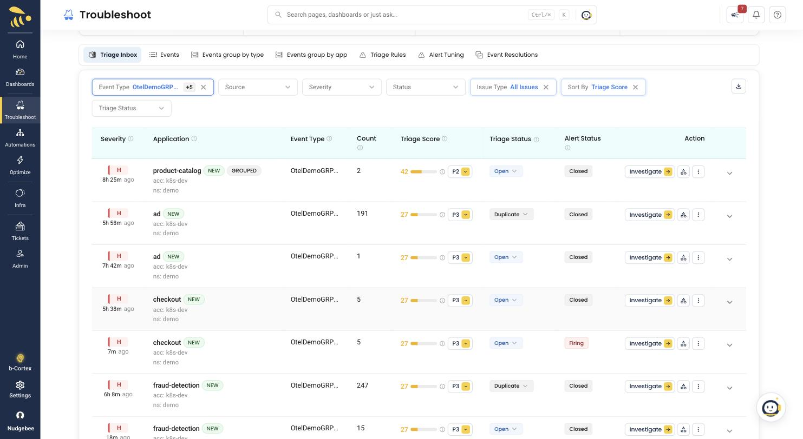

# Scenario walkthroughs

Step-by-step runs of each scenario that NudgeBee actually detects, with the
commands, the objective check that proves the fault is real, what the product
shows, and the rough edges worth knowing before you present.

Setup lives in the [main README](../README.md). The full catalogue --
including the scenarios that produce **no** signal and why -- is in
[`scenarios.yaml`](../scenarios.yaml).

| # | Scenario | Flag | Detected on | Time |
| --- | --- | --- | --- | --- |
| [A](./01-database-outage.md) | Database outage | `postgresFailure=on` | `product-catalog` + `checkout` | ~2.5 min |
| [B](./02-memory-leak.md) | Memory leak | `emailMemoryLeak=10000x` | `email` | <30s |
| [C](./03-slow-dependency.md) | Slow dependency | `postgresSlow=6sec` | `product-catalog` | ~2.5 min |
| [D](./04-payment-failure.md) | Payment failure | `paymentFailure=100%` | `checkout` only | -- |
| [E](./05-payment-unreachable.md) | Payment unreachable | `paymentUnreachable=on` | `checkout` only | ~2.7 min |

## Which one to demo

- **Most complete story:** [A](./01-database-outage.md). Root cause, quoted
  error, and a measured cascade into a second service.
- **Most reliable:** [B](./02-memory-leak.md). No alert rules involved, so it
  works before you have finished setting up Prometheus rules. Highest triage
  score (P1), and the score breakdown is shown.
- **Best for an SRE audience:** [C](./03-slow-dependency.md). Explains why
  symptom-based alerting points at the wrong service, and has the strongest
  evidence section of the set -- exact SQL, trace IDs, healthy-query
  comparison, CPU ruled out with numbers.
- **Blast-radius reasoning:** [D](./04-payment-failure.md) and
  [E](./05-payment-unreachable.md). The alert fires on the caller, and the
  answer is a service the alert never mentions.

## Rules that apply to all of them

**Give the investigation ~10 minutes before you judge it.** It runs a fast
first pass, then a deeper one that overwrites the first **in place**. The
early pass can say `Root Cause: Undetermined -- insufficient evidence` for an
event whose finished report is excellent -- measured on Scenario C: alert at
17:45:34, final investigation written at 17:54:38. Nothing in the UI marks
which pass you are reading, and `Generate RCA` will not help (it is a no-op
while a completed analysis exists). Wait and reload.

**Leave the fault running** until the investigation and any follow-up
questions have finished. NudgeBee inspects live state; reset too early and it
will correctly report that nothing is wrong *now*.

**Drain between scenarios.**

```bash
./scenario.sh --drain http://localhost:9090     # or set PROM_URL
```

This resets every fault flag, waits until no `OtelDemo*` alert is firing, then
settles so the trace window is clean. Investigations read traces from around
the alert, so a previous fault's errors otherwise land in the next scenario's
evidence.
[Scenario C](./03-slow-dependency.md#let-the-previous-scenario-drain-first)
documents a real run where skipping this produced an
`Undetermined -- insufficient evidence` result.

**Always `--check`.** `scenario.sh --check <flag>` asks flagd what it is
really serving. That separates three situations you otherwise cannot tell
apart: the write did not land, the flag is served but the service ignores it,
or everything works and NudgeBee genuinely saw nothing. Only the third is a
finding.

**Two flag pairs conflict.** `paymentFailure` starves `emailMemoryLeak` of
traffic; `paymentFailure` and `paymentUnreachable` fire the same alert on the
same service. Details in each walkthrough.

**Check for `Duplicate of` in the sidebar before presenting an RCA.** An event
that dedups into an existing chain can be given the **chain leader's**
incident narrative rather than its own. We hit this hard on
[Scenario E](./05-payment-unreachable.md#the-dedup-chain-will-hijack-the-rca):
the Insights panel correctly showed a failed card charge while the root cause
above it described a PostgreSQL latency incident from 75 minutes earlier.
When the two disagree, Insights is the honest one. Running scenarios on a
service that has been quiet avoids it.

## Finding the events

The `OtelDemo*` alert rules exist only for this demo, so filtering
**Troubleshoot -> All Events -> Triage Inbox** by **Event Type** to those
rules gives a demo-only view. The filter is stored in the URL, so it is
bookmarkable.



## A note on triage scores

Every scenario here runs in a namespace classified `non_prod`, which applies a
-8 penalty. That is why a total catalog outage scores 27 / P3. The scores are
internally consistent, but do not present them as what the same incident would
score in production.
